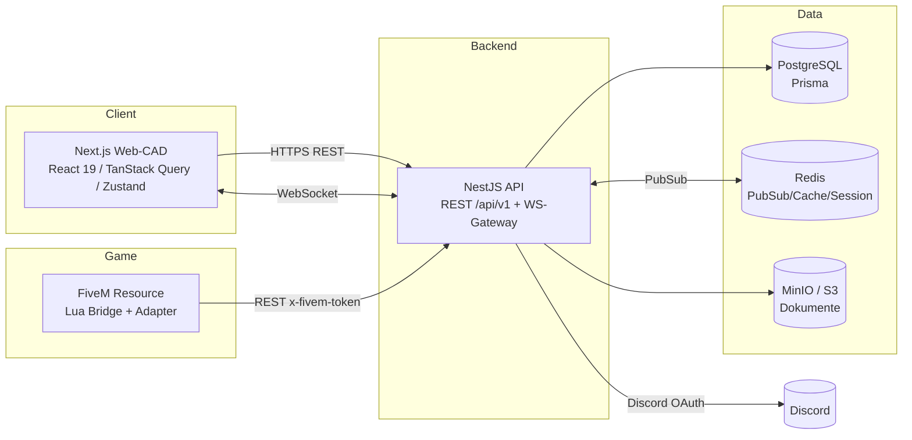

# Systemarchitektur

## Leitprinzip

Externe **Web-Plattform** (Out-of-Game CAD/RMS) plus eine schlanke **FiveM-Lua-Bridge**.
Die Bridge ist *dünn*: sie liefert nur In-Game-Signale (Position, Duty, Notruf) und empfängt
Status-Pushes. Alle Domänenlogik (Akten, RBAC, Workflows, Audit) liegt im NestJS-Backend.

## C4 — Container

## Request-Flows

### Auth (Discord OAuth → JWT)
1. Web → `GET /api/v1/auth/discord` → Redirect zu Discord.
2. Discord-Callback → Backend tauscht Code, lädt Profil, upsert `User`.
3. Backend stellt **Access-JWT** (kurzlebig) + **Refresh-Token** (rotierend, in `RefreshToken`) aus.
4. Web hält Access-Token im Memory, Refresh per HttpOnly-Cookie. Silent-Refresh bei 401.

### Akten-Zugriff (RBAC + Sicherheitsstufe)
1. Request trägt Access-JWT → `JwtGuard` → `ActorContext` (Fraktion, Rang-Tier, Clearance).
2. `AbilityGuard` (CASL, `packages/rbac`) prüft Action×Subject + Record-Conditions
   (`ownerFactionId`, `securityLevelRank ≤ clearance`).
3. Treffer → Service liest via Prisma. Jeder Zugriff erzeugt `AuditLog` (append-only).

### Realtime (Live-Karte / Dispatch)
1. Web öffnet WS, `subscribe:sector`.
2. FiveM-Bridge POSTet Positionen → `FivemService` → `RealtimeGateway.broadcastPosition`.
3. Mehr-Instanz-Fanout via Redis-Pub/Sub (`@socket.io/redis-adapter`, Phase 3).

## Bounded Contexts → NestJS-Module

Siehe [`MODULES.md`](MODULES.md). Jeder Kontext = eigenes Nest-Modul mit Controller/Service/
Prisma-Zugriff; geteilte Verträge in `packages/shared`, Rechte in `packages/rbac`.

## Nicht-funktionale Anforderungen

- **Skalierung:** API zustandslos (JWT), WS über Redis-Adapter horizontal skalierbar.
- **Sicherheit:** siehe [`SECURITY.md`](SECURITY.md). Audit unveränderlich, hash-verkettet.
- **Performance:** Positions-Push < 2 s (Spec). Redis-Cache für Hot-Reads.
- **Wartbarkeit:** Monorepo, geteilte Typen/Enums, ein RBAC-Modell für FE+BE.
