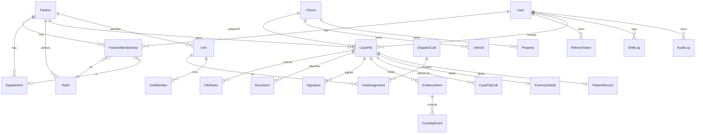

# Datenmodell (Kern, Phase 1)

Quelle: [`packages/database/prisma/schema.prisma`](../packages/database/prisma/schema.prisma).
Phase 1 deckt das Fundament ab; alle 36 Module folgen in Phase 2.

## Designentscheidung: polymorphe Akte

Eine `CaseFile`-Basis trägt alle gemeinsamen Felder (UUID, `ownerFaction`, `creator`,
`securityLevel`, `status`, `shareStatus`, Audit-Bezug). Der `type`-Discriminator unterscheidet
die Aktenart. Typ-spezifische Daten liegen in 1:1-Detailtabellen (`ForensicDetail`,
`PatientRecord`, …). Vorteile: fraktionsübergreifende Verknüpfung (`CaseFileLink`) und
Freigabe (`FileShare`) ohne pro-Typ-Duplikatlogik; `securityLevelRank` (1..5) ist
denormalisiert für effizientes RBAC-Filtering.

## ERD (Kern)

## Schlüssel-Entitäten

| Entität | Zweck |
|---|---|
| `User` / `RefreshToken` | Auth, Discord-Verknüpfung, persönliche Clearance |
| `Faction` / `Department` / `Rank` / `FactionMembership` | RBAC-Hierarchie, datengetriebene Rangstrukturen |
| `Citizen` / `Vehicle` / `Property` | Register |
| `CaseFile` (+ `CaseFileLink`) | polymorphe Akte, Verknüpfungen |
| `FileShare` | Freigabe-Workflow (Status, Ziel-Typ, Feld-Whitelist) |
| `ForensicDetail` / `EvidenceItem` / `CustodyEvent` | Forensik + Chain-of-Custody |
| `PatientRecord` | EMS mit geschützten Feldern |
| `Document` / `Signature` | DMS, digitale Signatur (Hash) |
| `DispatchCall` / `Unit` / `UnitMember` / `UnitAssignment` | CAD/Leitstelle |
| `ShiftLog` | Workforce / Dienstzeit |
| `AuditLog` | append-only, hash-verkettet |

## Migrations / Seed

- `pnpm db:migrate` — erstellt Schema.
- `pnpm db:seed` — Kern-Fraktionen (LSPD/BCSO/EMS/LSFD/DOJ/FOR/GOV), Rang-Template
  Officer→Chief inkl. `shareTier`/`clearance`, Plattform-Admin, Demo-Bürger.
