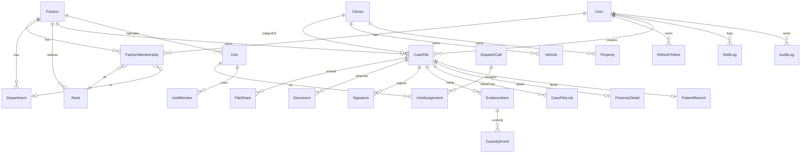
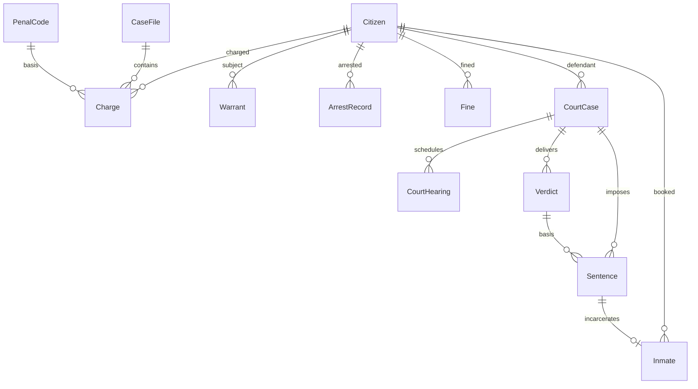
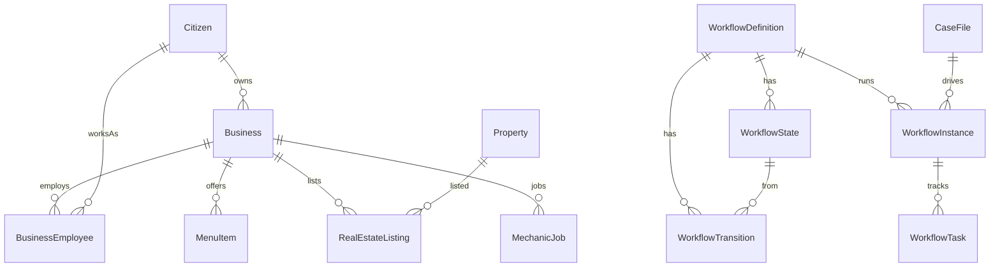

# Datenmodell (Vollmodell, Phase 2)

Quelle: [`packages/database/prisma/schema.prisma`](../packages/database/prisma/schema.prisma)
(~55 Modelle, alle 36 Module). Baseline-Migration:
[`prisma/migrations/20260615000000_init/migration.sql`](../packages/database/prisma/migrations/20260615000000_init/migration.sql).

## Modell-Inventar nach Domäne

| Domäne | Modelle |
|---|---|
| Identity/Auth | User, RefreshToken |
| RBAC | Faction, Department, Rank, FactionMembership |
| Register | Citizen, Vehicle, VehicleRegistration, Insurance, Property |
| Aktensystem | CaseFile, CaseFileLink, FileShare |
| Forensik | ForensicDetail, EvidenceItem, CustodyEvent |
| Medical | PatientRecord, MedicalIncident, FireIncident |
| Justice | PenalCode, Charge, Warrant, Bolo, ArrestRecord, Fine, CourtCase, CourtHearing, Verdict, Sentence |
| Corrections | Inmate |
| Government/DMV/Customs | License, GovLaw, CustomsDeclaration |
| Business | Business, BusinessEmployee, MenuItem, RealEstateListing, MechanicJob, SecurityContract, NewsArticle |
| Dispatch/CAD | DispatchCall, CallNote, Sector, StatusCode, Unit, UnitMember, UnitAssignment |
| Workforce | ShiftLog, ShiftSchedule, ShiftAssignment, LeaveRequest |
| Workflow-Engine | WorkflowDefinition, WorkflowState, WorkflowTransition, WorkflowInstance, WorkflowTask |
| Dokumente | Document, DocumentVersion, Signature |
| Platform | Notification, AuditLog |

## Designprinzip Actor-Referenzen

Domänen-Relationen (Citizen↔Register, CourtCase↔Hearing/Verdict/Sentence, Business↔Employee,
Workflow↔State/Transition) sind echte Prisma-Relationen mit Back-Refs. **Actor-Felder**
(officer/issuedBy/judge/prosecutor/author/assignee …) sind denormalisierte `@db.Uuid`-Strings
**ohne FK** — verhindert Relation-Explosion auf `User`; Auflösung im Backend-Service.

## Designentscheidung: polymorphe Akte

Eine `CaseFile`-Basis trägt alle gemeinsamen Felder (UUID, `ownerFaction`, `creator`,
`securityLevel`, `status`, `shareStatus`, Audit-Bezug). Der `type`-Discriminator unterscheidet
die Aktenart. Typ-spezifische Daten liegen in 1:1-Detailtabellen (`ForensicDetail`,
`PatientRecord`, …). Vorteile: fraktionsübergreifende Verknüpfung (`CaseFileLink`) und
Freigabe (`FileShare`) ohne pro-Typ-Duplikatlogik; `securityLevelRank` (1..5) ist
denormalisiert für effizientes RBAC-Filtering.

## ERD (Kern)

## Schlüssel-Entitäten

| Entität | Zweck |
|---|---|
| `User` / `RefreshToken` | Auth, Discord-Verknüpfung, persönliche Clearance |
| `Faction` / `Department` / `Rank` / `FactionMembership` | RBAC-Hierarchie, datengetriebene Rangstrukturen |
| `Citizen` / `Vehicle` / `Property` | Register |
| `CaseFile` (+ `CaseFileLink`) | polymorphe Akte, Verknüpfungen |
| `FileShare` | Freigabe-Workflow (Status, Ziel-Typ, Feld-Whitelist) |
| `ForensicDetail` / `EvidenceItem` / `CustodyEvent` | Forensik + Chain-of-Custody |
| `PatientRecord` | EMS mit geschützten Feldern |
| `Document` / `Signature` | DMS, digitale Signatur (Hash) |
| `DispatchCall` / `Unit` / `UnitMember` / `UnitAssignment` | CAD/Leitstelle |
| `ShiftLog` | Workforce / Dienstzeit |
| `AuditLog` | append-only, hash-verkettet |

## ERD — Justice

## ERD — Business & Workflow

## Migrations / Seed

- Baseline-Migration unter `prisma/migrations/20260615000000_init/` (per `migrate diff`
  ohne laufende DB generiert). Anwenden: `pnpm db:migrate` (dev) bzw. `prisma migrate deploy` (prod).
- `pnpm db:seed` — Fraktionen (LSPD/BCSO/EMS/LSFD/DOJ/COURT/DA/DOC/FOR/DMV/CBP/GOV),
  Rang-Template Officer→Chief, Plattform-Admin, Demo-Bürger, **Penal Code** (7 Delikte),
  **Sektoren** (Downtown…Paleto), **Status-Codes** (10-8/10-23…), **Gesetze**, Demo-Business
  (Burger Shot + Menü), Demo-Führerschein, **Verhaftungs-Workflow** (Verhaftung→DA→Gericht→
  Gefängnis→Archiv).
