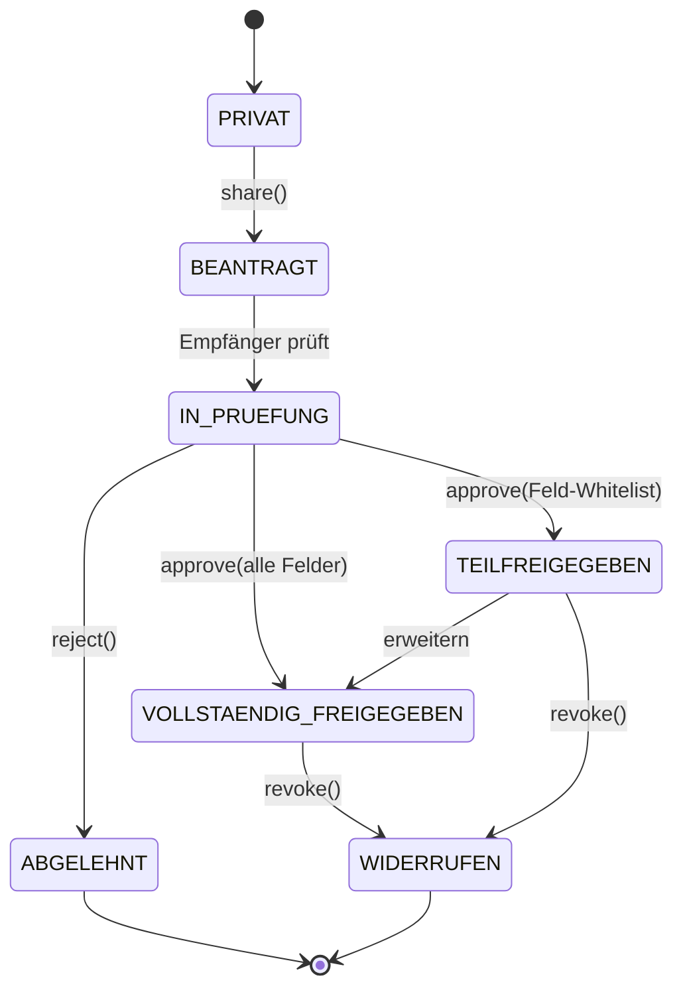

# Freigabe-Workflow & Workflow-Engine

## Freigabe-Statusmaschine



Persistiert in `FileShare` (`status`, `targetType`, `targetId`, `allowedFields`, `decidedBy`,
`expiresAt`). Übergänge sind rangabhängig (siehe [`SECURITY.md`](SECURITY.md)): `share` ab
Sergeant, `approve` ab Captain, `revoke` ab Chief.

## Freigabe-Ziele

`PERSON · ROLLE · ABTEILUNG · FRAKTION · BEHOERDE` (`ShareTargetType`).
Beispiele: Police→DOJ, Forensics→Police, EMS→DOJ, Government→Police, DOJ→Prison,
Forensics→District Attorney, Police→Court.

## Teilfreigabe (Field-Level)

`allowedFields` schränkt die sichtbaren Felder ein (z.B. EMS gibt nur `publicStatus` frei,
nicht `diagnoses`). Backend filtert die Antwort gegen die Whitelist; CASL prüft die Aktion.

## Workflow-Engine (Jira-artig, Phase 3)

Generische Status→Übergang-Definitionen pro Akten-/Fall-Typ. Beispiele:

```
Verhaftung   → Staatsanwalt → Gericht → Gefängnis → Archiv
Mordfall     → Ermittler → Forensik → Staatsanwalt → Gericht
Bewerbung    → HR → Interview → Einstellung
```

Jeder Übergang: erlaubte Rollen, Pflicht-Felder, automatische Benachrichtigung, Audit-Eintrag.
Implementierung als datengetriebene `WorkflowDefinition` + `WorkflowInstance` (Phase 2/3).
